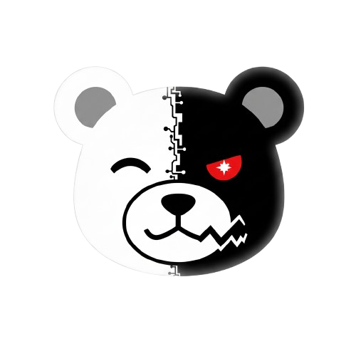
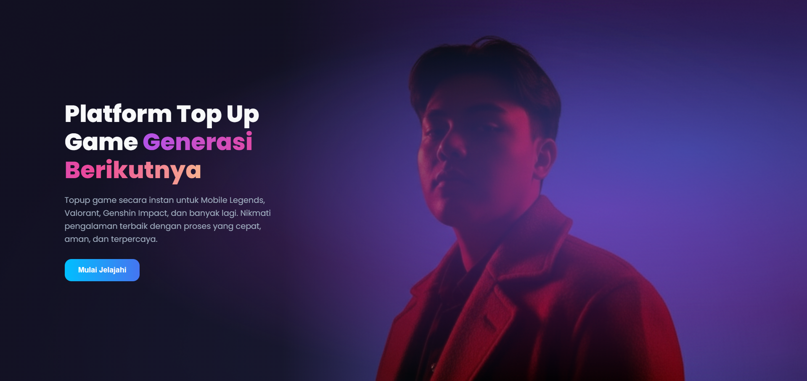
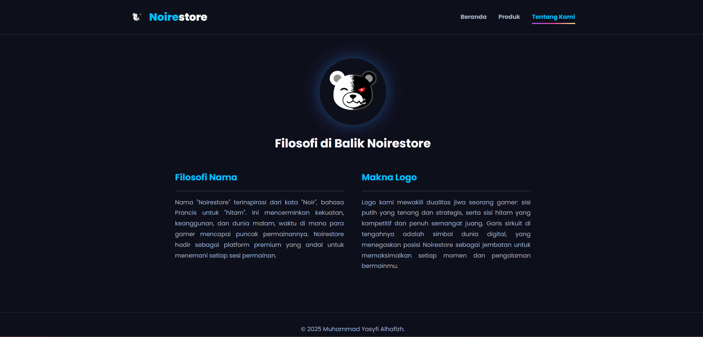

<p align="center">
  
</p>

<h1 align="center">Noirestore</h1>

<p align="center">
  <strong>Website E-commerce Fungsional untuk Layanan Top-Up Game</strong>
  <br />
  <br />
  <a href="https://noireveil.github.io/noirestore/"><strong>Lihat Demo Langsung »</strong></a>
</p>

<p align="center">
  
</p>

---

## ✨ Tampilan Web

Berikut adalah tampilan dari halaman landing yang imersif dan halaman "Tentang Kami" yang menampilkan filosofi brand.

<table align="center">
  <tr>
    <td align="center"><strong>Halaman Landing</strong></td>
    <td align="center"><strong>Halaman Tentang Kami</strong></td>
  </tr>
  <tr>
    <td></td>
    <td></td>
  </tr>
</table>

---

## 📖 Tentang Proyek

**Noirestore** adalah sebuah proyek website statis yang dirancang untuk memenuhi tugas mata kuliah Perancangan dan Pemrograman Web. Proyek ini mensimulasikan sebuah platform e-commerce yang berfokus pada layanan top-up game, dibangun dari dasar untuk menunjukkan pemahaman fundamental dalam pengembangan web front-end.

### Fitur Utama:
* **Halaman Landing Animasi:** Halaman pembuka yang imersif sebelum masuk ke konten utama.
* **Katalog Produk:** Tampilan berbagai produk top-up game yang dikelompokkan berdasarkan game.
* **Desain Modern:** Menggunakan tema gelap (*dark mode*) yang populer di kalangan gamer.
* **Animasi Interaktif:** Efek mesin ketik pada teks dan logo yang melayang untuk pengalaman pengguna yang lebih dinamis.

---

## 🛠️ Teknologi yang Digunakan

Proyek ini dibangun sepenuhnya menggunakan teknologi web fundamental tanpa bantuan *framework* atau *library* eksternal.

* **HTML5:** Digunakan untuk struktur dasar dan konten dari setiap halaman.
* **CSS3 (Native):** Bertanggung jawab untuk seluruh styling, layouting, dan animasi.
    * **Flexbox & Grid:** Untuk membangun layout yang responsif dan terstruktur.
    * **Custom Properties (Variables):** Untuk manajemen tema dan warna yang efisien.
    * **Keyframe Animations & Transitions:** Untuk semua efek visual, mulai dari tombol hingga logo yang melayang.
* **JavaScript (Pure / Vanilla JS):** Digunakan untuk semua fungsionalitas dan interaktivitas.
    * **Manipulasi DOM:** Untuk mengontrol animasi masuk dan efek mesin ketik.
    * **ES6+ Features:** Termasuk `Promise` dan `async/await` untuk mengelola urutan animasi secara elegan.

---

## 🚀 Cara Menjalankan Secara Lokal

1.  **Clone repository ini:**
    ```bash
    git clone [https://github.com/noireveil/noirestore.git](https://github.com/noireveil/noirestore.git)
    ```
2.  **Masuk ke direktori proyek:**
    ```bash
    cd noirestore
    ```
3.  **Buka file `index.html`** di browser pilihan Anda.
